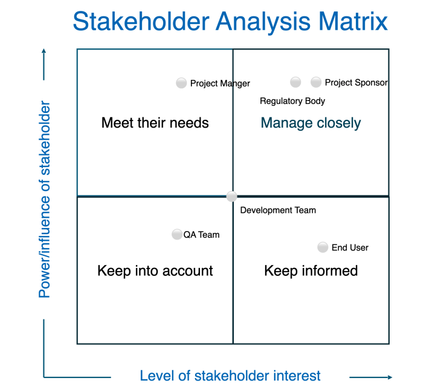

# BTS535-Lab9

### Stakeholder Analysis Matrix

> By:
> - Jiseok Shim
> - Anurag Das
> - Japit Singh

[BTS535 Lab 9 Stakeholder Analysis Matrix](BTS535_Lab_9_Stakeholder_Analysis_Matrix.xlsx)

### Communications Plan

> By:
> - Maksym Volkovynskyi
> - Daniel Krause

| **Stakeholder Group**       | **Interest/Power**            | **Communication Objectives**                                    | **Preferred Communication Methods**          | **Frequency**          | **Responsible Party**     |
|------------------------------|-------------------------------|----------------------------------------------------------------|-----------------------------------------------|-------------------------|---------------------------|
| QA Team                     | Low Interest / Low Power      | Provide minimal updates to keep informed when necessary       | Email updates, project dashboard             | Monthly or as needed   | Project Manager           |
| End Users                   | High Interest / Low Power     | Keep informed, gather feedback, ensure usability               | Surveys, newsletters, training sessions      | Bi-weekly updates       | Business Analyst          |
| Project Manager             | Low Interest / High Power     | Ensure alignment with key decisions and overall progress       | Executive summaries, status reports          | Weekly                 | Team Leads                |
| Regulatory Body             | High Interest / High Power    | Ensure compliance and address requirements                     | Detailed reports, compliance reviews          | As required (milestone-based) | Compliance Officer      |
| Project Sponsor             | High Interest / High Power    | Provide high-level updates, ensure buy-in, and address concerns| Presentations, executive meetings            | Weekly or milestone-based | Project Manager         |
| Development Team            | Medium Interest / Medium Power| Align on project tasks, address blockers, and share updates    | Daily stand-ups, sprint reviews              | Daily/Weekly           | Scrum Master/Team Leads   |

